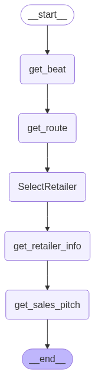

# 🧠 Agentic AI Sales Co-Pilot

A multi-agent, graph-driven assistant designed for field sales representatives in the CPG/FMCG industry. Built using **LangGraph**, **Streamlit**, and a hybrid of rule-based + ML models, this tool helps automate and enhance daily sales operations.

---

## 🚀 Features

- ✅ **Beat Assignment**: Automatically fetches assigned beats for the sales rep based on the day.
- 📍 **Route Planning**: Retrieves optimal store visit sequence using pre-optimized route plans.
- 🛍️ **Retailer Selection**: Selects the retailer based on user input using semantic matching.
- 🧠 **Product Recommendations**: Hybrid rule-based + ML engine recommends products for each retailer.
- 🗣️ **Pitch Summarization**: Generates a sales pitch combining recommendation and stock insights.
- 🧭 **Agentic Workflow Visualization**: View the agent flow via a visual graph.
- 💬 **Chat UI**: Guided conversational interface with memory checkpointing using `MemorySaver`.

---

## 🧱 Agent Flow Diagram



---

## 📦 Setup Instructions
* Clone the repo
```
git clone https://github.com/your-username/sales-agent.git
cd sales-agent
```

* Create a virtual environment & activate

```
python -m venv salesagent
source salesagent/bin/activate  # or .\salesagent\Scripts\activate on Windows
```
* Install dependencies

```
pip install -r requirements.txt
```
* Launch the app

```
streamlit run app.py
```

---

### 👤 Author
Simanta Nigam Nayak</br>
Senior Consultant AI and Data Science</br>
LinkedIn - [https://www.linkedin.com/in/simantnigam/]
